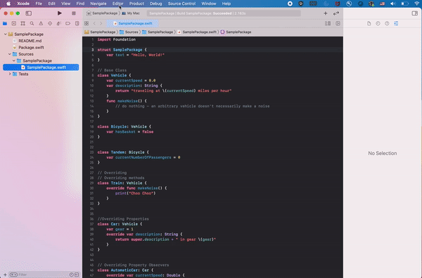
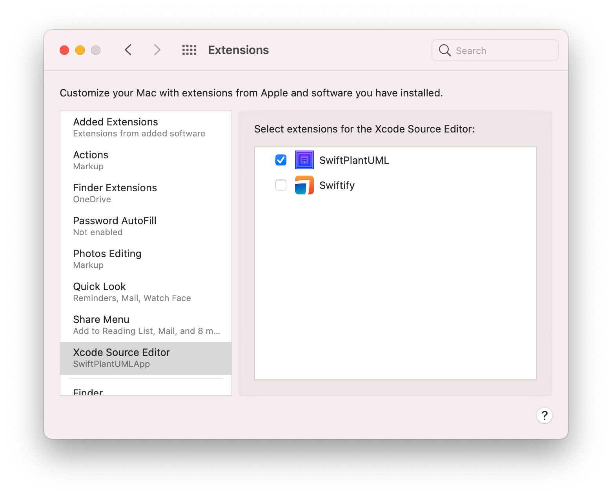

<p align="center">
    
</p>


[](#)
[](http://twitter.com/MarcoEidinger)
# SwiftPlantUML.app

A macOS application to generate and view a class diagram for Swift code in Xcode with this extension.

The Source Editor Extension (as well as the Action extension) makes use of [SwiftPlantUML](https://github.com/MarcoEidinger/SwiftPlantUML) Swift package.

To generate a large diagram from a project with Swift files across folders then I recommend using `SwiftPlantUML` as a command-line tool.

## Features

### Xcode
- [X] 📊 Create class diagram from Swift file    
- [X] 🔦 Create class diagram from selected Swift code



### Finder
- [X] 📊 Create class diagram from selected Swift file(s)  

https://user-images.githubusercontent.com/4176826/218329052-b03ec650-d845-46a2-a31b-6d3817add52a.mp4

## Example


## Install

Homebrew

```bash
brew install swiftplantumlapp
```


*Alternative*
- Download latest *SwiftPlantUML* package from the [Releases](https://github.com/MarcoEidinger/SwiftPlantUML-Xcode-Extension/releases).
- Copy *SwiftPlantUML* to your *Applications* folder.

## Enable Extension
- Launch *SwiftPlantUML*.

  
  
- To use in **Xcode**: enable extension in <kbd>System Preferences</kbd> > <kbd>Extensions</kbd> > <kbd>Xcode Source Editor</kbd> > select <kbd>SwiftPlantUML</kbd>

  

- To use in **Finder**: enable extension in <kbd>System Preferences</kbd> > <kbd>Extensions</kbd> > <kbd>Finder</kbd> > select <kbd>Open Swift Class Diagram</kbd>

  

## Configure

*Optional*:

TODO

  

  

  


## Troubleshooting

### The command "Open editable diagram in browser" is still busy

Xcode Source Code Extension initialization might take up ~ 30 seconds on initial launch.

If the prompt does not appear within 60 seconds 


then check for a crash report related to XPC service in Console app of your MacOS.


If you see such crash report related to `fatal error: Loading sourcekitd.framework/Versions/A/sourcekitd failed` please check the installation path of Xcode. If it's installed under `/Applications/Xcode.app`, please run:

```
sudo xcode-select -s /Applications/Xcode.app/Contents/Developer
```

If it's installed elsewhere, please replace the `/Applications/Xcode.app` path in the command above with the location where you've installed Xcode.


## Technical Details

This Source Editor Extension makes use of XPC service to run the app sandboxed and use `SwiftPlantUML` (and its dependency `SourceKitten`). Source Editor Extensions using `SourceKitten` (either directly or indirectly) have to either run in a non-sandboxed app (and could not be distributed via the App Store) or use XPC service to outsource the use of `SourceKitten` to a different process.

# Acknowledgements

These awesome blog posts helped me to dive into Xcode Source Editor Extensions and XPC services

- https://www.vadimbulavin.com/xcode-source-editor-extension-tutorial/
- https://nshipster.com/xcode-source-extensions/
- https://ilya.puchka.me/xcode-source-editor-extension-superpowered-with-sourcekitten/
- https://www.objc.io/issues/14-mac/xpc/
